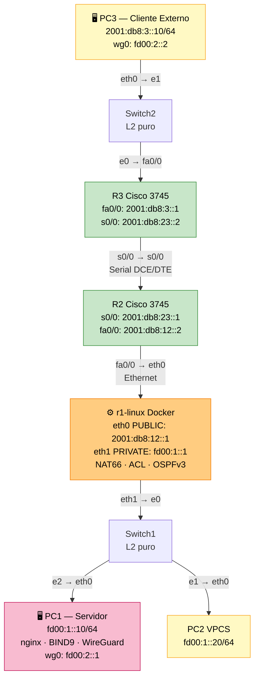
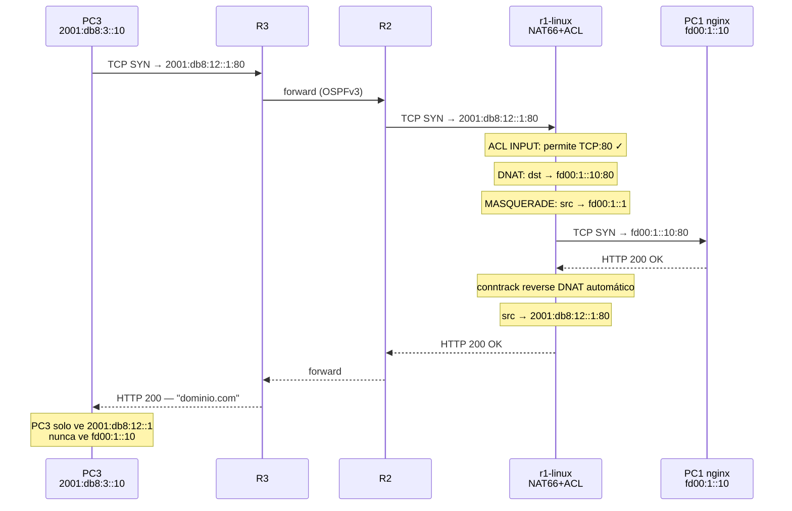
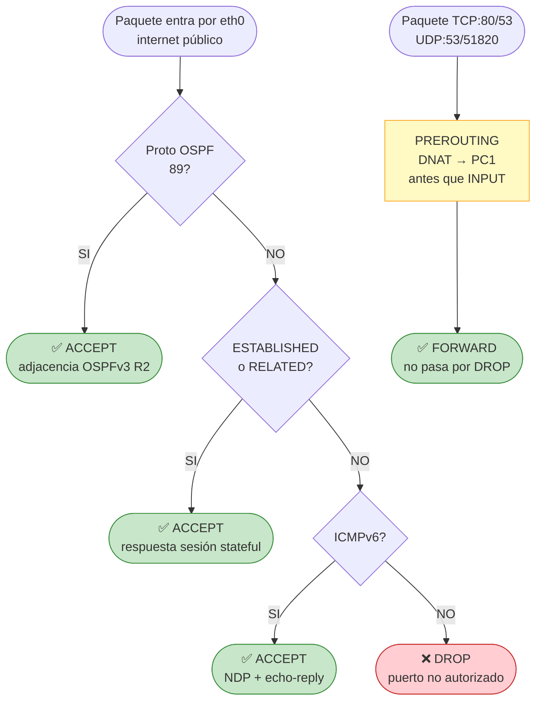
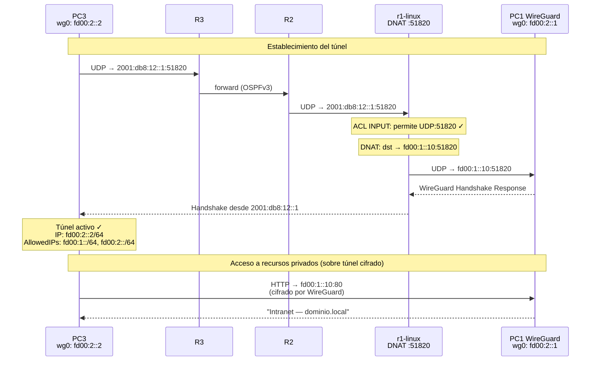
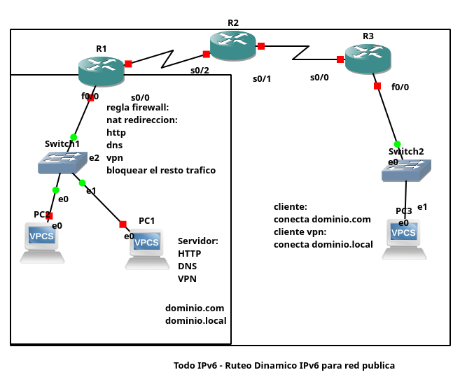

# Lab IPv6 — Ruteo Dinamico, NAT66, ACL y VPN WireGuard

<a href="https://youtu.be/Ts1ylG4d4fo" target="_blank">
  
</a>

---

## Diagramas

> Archivo PlantUML completo: [`diagrama-red.puml`](diagrama-red.puml)
> (abrir con extension PlantUML en VSCode o en [plantuml.com](https://plantuml.com/plantuml))

### Topologia de Red



### Flujo HTTP — dominio.com sin VPN



### Flujo ACL — Decisiones ip6tables en eth0



### Flujo VPN WireGuard — PC3 → R1-Linux → PC1



---

## Glosario de Tecnologias

### IPv6 — Estructura de una direccion

Una direccion IPv6 tiene **128 bits** escritos como 8 grupos de 4 digitos hexadecimales separados por `:`.

```
2001:0db8:0012:0000:0000:0000:0000:0001
```

Reglas de abreviacion:

- Los ceros iniciales de cada grupo se omiten: `0db8` → `db8`
- Un bloque consecutivo de grupos todo-cero se reemplaza con `::` (solo una vez)

```
2001:db8:12::1   =   2001:0db8:0012:0000:0000:0000:0000:0001
fd00:1::10       =   fd00:0001:0000:0000:0000:0000:0000:0010
```

El sufijo `/64` indica el prefijo de red (los primeros 64 bits son la red,
los 64 restantes identifican al host dentro de esa red).

### GUA — Global Unicast Address

Equivalente a las IPs publicas de IPv4. Son enrutables en internet.
Rango: `2000::/3` (empieza con `2` o `3`).

```
En este lab:
  2001:db8:12::1   (R1-Linux, entrada publica)
  2001:db8:3::10   (PC3, cliente externo)
  2001:db8:23::1   (R2 Serial, enlace interno)
```

### ULA — Unique Local Address

Equivalente a las IPs privadas de IPv4 (192.168.x.x, 10.x.x.x).
No son enrutables en internet. Rango: `fc00::/7` (empieza con `fd`).

```
En este lab:
  fd00:1::1    (R1-Linux, gateway LAN interna)
  fd00:1::10   (PC1 servidor, solo red privada)
  fd00:1::20   (PC2 VPCS, cliente interno)
  fd00:2::1    (PC1 extremo VPN)
  fd00:2::2    (PC3 extremo VPN)
```

### OSPFv3 — Protocolo de Ruteo Dinamico

Open Shortest Path First version 3. Protocolo de ruteo de estado de enlace
para IPv6. Cada router anuncia las subredes de sus interfaces conectadas
y aprende las del resto de la red. Sustituye a la configuracion manual de
rutas estaticas.

- Todos los routers comparten el mismo **Area 0** (backbone)
- Cada router tiene un **router-id** de 32 bits en formato IPv4 (ej: `1.1.1.1`)
- Los routers intercambian **Hello packets** para descubrir vecinos
- El estado se propaga hasta que todos tienen el mismo mapa de la red

```
En este lab r1-linux anuncia fd00:1::/64 ->
R2 aprende que para llegar a PC1 debe ir a r1-linux ->
R3 aprende que para llegar a PC1 debe ir a R2 -> r1-linux
```

### DNS — Domain Name System

Traduce nombres de dominio a direcciones IPv6 (registros AAAA).
En este lab BIND9 en PC1 sirve dos zonas:

- `dominio.com` — zona publica, resuelve a `2001:db8:12::1` (R1-Linux)
- `dominio.local` — zona privada, resuelve a `fd00:1::10` (PC1 ULA),
  solo accesible desde la VPN

### HTTP — HyperText Transfer Protocol

Protocolo de transferencia web en puerto TCP:80. En este lab nginx
en PC1 sirve dos sitios virtuales (vhosts):

- `dominio.com` → pagina publica, accesible sin VPN via NAT66 DNAT
- `intranet.dominio.local` → pagina privada, solo accesible con VPN activa

### NAT66 — Network Address Translation para IPv6

Reescribe la direccion IPv6 de destino de un paquete entrante (DNAT).
Permite que PC1 tenga solo una IP privada (ULA) mientras R1-Linux
recibe el trafico publico y lo redirige.

```
Sin NAT66: cliente necesita conocer la IP real de PC1
Con NAT66: cliente habla con 2001:db8:12::1 (R1-Linux)
           R1-Linux redirige internamente a fd00:1::10 (PC1)
           PC1 nunca expone su IP real al exterior
```

### ACL — Access Control List

Lista de reglas que filtra trafico por criterios (protocolo, puerto,
interfaz, estado de conexion). En ip6tables se implementan como reglas
en cadenas INPUT y FORWARD.

- **INPUT**: trafico destinado al propio router (R1-Linux)
- **FORWARD**: trafico que pasa por el router hacia otro destino
- **ESTABLISHED/RELATED**: stateful — permite respuestas a sesiones ya abiertas
- **DROP**: descarta el paquete sin notificar al emisor

### WireGuard — VPN moderna

Protocolo VPN moderno que usa criptografia de curva eliptica (Curve25519).
Mas simple y eficiente que OpenVPN o IPsec. Funciona sobre UDP.
En este lab PC3 establece el tunel hacia R1-Linux que hace DNAT
al puerto 51820 de PC1. El tunel cifra todo el trafico entre PC3 y la
red interna del lab.

---

## Como funcionan ping, ping6 y traceroute

### ping y ping6 — Protocolo ICMPv6 / ICMP

`ping` usa el protocolo **ICMP** (Internet Control Message Protocol).
`ping6` usa **ICMPv6**, la version para IPv6 (definido en RFC 4443).

No usan TCP ni UDP — son mensajes de control embebidos directamente
en la capa de red (IPv4 o IPv6), sin numero de puerto.

```
IPv6 Header
  Next Header = 58 (ICMPv6)
  [Type=128 Echo Request]  <- lo que envia ping6
  [Type=129 Echo Reply]    <- lo que responde el destino
```

Cuando ejecutas `ping6 2001:db8:12::1`:

1. PC3 envia un **Echo Request** (tipo 128) al destino
2. R1-Linux recibe el paquete ICMPv6
3. La ACL tiene `ip6tables -A INPUT -i eth0 -p ipv6-icmp -j ACCEPT`
4. R1-Linux responde con un **Echo Reply** (tipo 129)
5. PC3 mide el tiempo de ida y vuelta (RTT)

Si la ACL tuviese `-j DROP` para ICMPv6, el ping no responderia
aunque la ruta existiera. Por eso ping confirma que:

- La ruta IP existe (OSPFv3 convergido)
- La ACL permite ICMPv6
- El host destino esta activo

### traceroute6 — Como funciona con TTL

`traceroute6` usa el campo **Hop Limit** de IPv6 (equivalente al TTL
de IPv4) para descubrir los routers intermedios en la ruta.

**TTL (Time To Live) / Hop Limit:**
Cada paquete IPv6 tiene un campo Hop Limit (8 bits, valor 0-255).
Cada router que reenvía el paquete **decrementa ese valor en 1**.
Si llega a 0, el router **descarta el paquete** y devuelve un
mensaje ICMPv6 tipo 3 (Time Exceeded) al origen.

**Algoritmo de traceroute:**

```
Iteracion 1: envia paquete con Hop Limit = 1
  -> R3 lo recibe, decrementa a 0, descarta
  -> R3 envia ICMPv6 "Time Exceeded" a PC3
  -> PC3 sabe que el primer salto es R3

Iteracion 2: envia paquete con Hop Limit = 2
  -> R3 decrementa a 1, reenvía a R2
  -> R2 decrementa a 0, descarta
  -> R2 envia ICMPv6 "Time Exceeded" a PC3
  -> PC3 sabe que el segundo salto es R2

Iteracion 3: envia paquete con Hop Limit = 3
  -> R3 decrementa, R2 decrementa, R1-Linux recibe con HL=1
  -> R1-Linux lo descarta o lo entrega
  -> La ACL de R1-Linux bloquea ICMPv6 Time Exceeded saliente
  -> PC3 ve * (sin respuesta)
```

```
PC3 → traceroute6 2001:db8:12::1

Salto 1:  2001:db8:3::1   ← R3 respondio con Time Exceeded
Salto 2:  2001:db8:23::1  ← R2 respondio con Time Exceeded
Salto 3:  *               ← R1-Linux no responde (ACL bloquea)
```

R1-Linux no responde en el salto 3 porque la ACL solo permite
ICMPv6 de tipo **echo-reply** (respuestas a ping), no Time Exceeded.
El `*` no significa que no llegue — el HTTP y DNS si funcionan.

### Por que traceroute no funciona dentro del tunel WireGuard

Cuando PC3 hace `traceroute6 fd00:1::10` con VPN activa, todos los
saltos muestran `*`. Esto NO es un error — es el comportamiento
correcto y esperado de WireGuard.

**La razon tecnica:**

WireGuard opera en **kernel space** como interfaz punto a punto.
Cuando PC3 envia un paquete con Hop Limit=1 hacia `fd00:1::10`:

```
Paquete interno (lo que ve traceroute):
  src=fd00:2::2  dst=fd00:1::10  HopLimit=1

WireGuard en PC3 cifra el paquete completo y lo mete en UDP:
  Paquete externo (lo que ven los routers):
  src=2001:db8:3::10  dst=2001:db8:12::1  UDP:51820  HopLimit=64
  [datos cifrados que contienen el paquete interno]
```

Los routers R3, R2 y R1-Linux solo ven el **paquete externo UDP**
con HopLimit=64. Nunca ven el HopLimit=1 del paquete interno.
Por lo tanto **nunca generan ICMPv6 Time Exceeded** para el paquete
interno. El tunel es invisible para traceroute.

```
Ruta PUBLICA — traceroute funciona:
PC3 ─────────────────────────────────────────► R1-Linux
      R3 ve paquete real    R2 ve paquete real
      HopLimit decrementado → ICMP Time Exceeded enviado

Ruta VPN — traceroute no funciona:
PC3 ═══════════════════════════════════════════► PC1
      R3 ve UDP cifrado     R2 ve UDP cifrado
      HopLimit interno oculto → nunca generan ICMP
```

**La prueba correcta con VPN activa es `ping6`:**

```bash
ping6 fd00:1::10   # 0% perdida = tunel funcionando
```

El `*` en traceroute con VPN NO significa que el tunel este roto.
El ping con `0% de perdida` es la verificacion correcta.

**No existe solucion practica:**
Se podria agregar una regla ip6tables artificial en r1-linux para
generar ICMP Time Exceeded, pero mostraria una ruta falsa que no
representa los saltos reales dentro del tunel.

---

## Comandos de Prueba — Referencia

| Comando                                                          | Protocolo | Puerto    | Que verifica                            | Resultado esperado         |
| ---------------------------------------------------------------- | --------- | --------- | --------------------------------------- | -------------------------- |
| `ping6 2001:db8:3::1`                                            | ICMPv6    | —         | Conectividad a gateway R3               | `0% packet loss`           |
| `ping6 2001:db8:23::1`                                           | ICMPv6    | —         | Alcance a R2 Serial via OSPFv3          | `0% packet loss`           |
| `ping6 2001:db8:12::2`                                           | ICMPv6    | —         | Alcance a R2 Ethernet via OSPFv3        | `0% packet loss`           |
| `ping6 2001:db8:12::1`                                           | ICMPv6    | —         | Alcance a R1-Linux (IP publica)         | `0% packet loss`           |
| `ping6 fd00:2::1`                                                | ICMPv6    | —         | Extremo VPN PC1 (solo con tunel activo) | `0% packet loss`           |
| `ping6 fd00:1::10`                                               | ICMPv6    | —         | PC1 ULA via tunel WireGuard             | `0% packet loss`           |
| `traceroute6 2001:db8:12::1`                                     | ICMPv6    | —         | Ruta PC3→R3→R2→R1 via OSPFv3            | 3 saltos visibles          |
| `curl -6 http://[2001:db8:12::1]/`                               | HTTP      | TCP:80    | Web publica via NAT66 DNAT              | HTML dominio.com           |
| `curl -6 http://[2001:db8:12::1]:8080/`                          | HTTP      | TCP:8080  | ACL bloquea puertos no permitidos       | timeout/conexion rechazada |
| `curl -6 -H "Host: intranet.dominio.local" http://[fd00:1::10]/` | HTTP      | TCP:80    | Intranet privada via VPN                | HTML intranet              |
| `dig AAAA dominio.com @2001:db8:12::1`                           | DNS       | UDP:53    | DNS via DNAT :53→PC1                    | `2001:db8:12::1`           |
| `dig AAAA dominio.com @fd00:1::10`                               | DNS       | UDP:53    | DNS directo a PC1 via VPN               | `2001:db8:12::1`           |
| `dig AAAA dominio.local @fd00:1::10`                             | DNS       | UDP:53    | Zona privada (solo VPN)                 | `fd00:1::10`               |
| `wg show`                                                        | WireGuard | UDP:51820 | Estado tunel VPN                        | `latest handshake: Xs ago` |
| `wg-quick up wg0`                                                | WireGuard | UDP:51820 | Levantar tunel hacia R1-Linux           | —                          |
| `wg-quick down wg0`                                              | WireGuard | —         | Bajar tunel (probar aislamiento)        | —                          |

> El traceroute muestra `*` en el salto 3 (R1-Linux) porque la ACL bloquea
> ICMP TTL-exceeded entrante desde eth0. Esto es correcto — el trafico HTTP
> y DNS si llega porque esos puertos estan permitidos.

---

## Verificacion de Requisitos del Enunciado

### REQ: ping6 a la direccion publica de R2 desde PC3

```bash
# Desde pc3-cliente
ping6 2001:db8:12::2    # R2 FastEthernet0/0
ping6 2001:db8:23::1    # R2 Serial0/0
```

```
PING 2001:db8:12::2 - 3 packets transmitted, 3 received, 0% packet loss
PING 2001:db8:23::1 - 3 packets transmitted, 3 received, 0% packet loss
```

R2 es alcanzable desde PC3 gracias a OSPFv3: R3 anuncia su red local
y aprende la red de R2, formando la ruta PC3→R3→R2.

### REQ: traceroute6 a dominio.com para verificar paso por OSPFv3

```bash
# dominio.com resuelve a 2001:db8:12::1 (R1-Linux)
traceroute6 -n 2001:db8:12::1
```

```
 1  2001:db8:3::1    (R3 fa0/0  — gateway local de PC3)
 2  2001:db8:23::1   (R2 s0/0   — enlace serial R2-R3, aprendido via OSPF)
 3  *                (R1-Linux  — bloquea ICMP desde eth0 por ACL, correcto)
```

El paso por R3 y R2 demuestra que OSPFv3 propago las rutas correctamente.
R1-Linux no responde ICMPv6 de diagnostico desde su interfaz publica
(ACL diseñada asi), pero si responde HTTP, DNS y WireGuard.

### REQ: Trafico web/dns/vpn llega al servidor via NAT y ACL

```bash
# Web via NAT66 DNAT :80
curl -6 http://[2001:db8:12::1]/
# -> "dominio.com" servido por nginx en PC1 (fd00:1::10)

# DNS via NAT66 DNAT :53
dig AAAA dominio.com @2001:db8:12::1
# -> 2001:db8:12::1 (resuelto por BIND9 en PC1)

# VPN via NAT66 DNAT :51820
wg show  # endpoint: [2001:db8:12::1]:51820, latest handshake: Xs ago
```

Los tres servicios llegan a PC1 gracias a las reglas DNAT en R1-Linux.
La ACL permite exactamente esos tres puertos y bloquea todo lo demas.

---

## Topologia



> La imagen muestra el diseño original. En la implementacion final **R1 es un
> contenedor Docker Linux** (no Cisco IOS) porque IOS 12.4 no soporta NAT66.
> R2 y R3 siguen siendo Cisco 3745.

### Diagrama real implementado

```
                         R2 (Cisco 3745)
                        /               \
               r1-linux                  R3 (Cisco 3745)
              (Docker)                    |
            eth0   eth1               Switch2 e0
             |       |                    |
           R2 fa0/0  Switch1 e0      Switch2 e1
                   /          \           |
              Switch1 e1   Switch1 e2   pc3-cliente (Docker)
                  |              |
               PC2 (VPCS)   pc1-servidor (Docker)
```

### Cableado fisico confirmado en GNS3

| Cable | Desde              | Hacia              | Tipo     |
| ----- | ------------------ | ------------------ | -------- |
| 1     | r1-linux eth0      | R2 FastEthernet0/0 | Ethernet |
| 2     | r1-linux eth1      | Switch1 Ethernet0  | Ethernet |
| 3     | R2 Serial0/0 (DCE) | R3 Serial0/0 (DTE) | Serial   |
| 4     | R3 FastEthernet0/0 | Switch2 Ethernet0  | Ethernet |
| 5     | PC2 VPCS eth0      | Switch1 Ethernet1  | Ethernet |
| 6     | pc1-servidor eth0  | Switch1 Ethernet2  | Ethernet |
| 7     | pc3-cliente eth0   | Switch2 Ethernet1  | Ethernet |

> **Nota GNS3:** El nodo etiquetado "R1" en GNS3 es nuestro R2 (router-id 2.2.2.2).
> El nodo etiquetado "R2" en GNS3 es nuestro R3 (router-id 3.3.3.3).

---

## Direccionamiento IPv6

| Dispositivo  | Interfaz | Direccion IPv6      | Tipo        | Rol                  |
| ------------ | -------- | ------------------- | ----------- | -------------------- |
| r1-linux     | eth0     | `2001:db8:12::1/64` | GUA publica | Entrada NAT66        |
| r1-linux     | eth1     | `fd00:1::1/64`      | ULA privada | Gateway LAN          |
| r1-linux     | —        | router-id `1.1.1.1` | OSPFv3      | —                    |
| R2           | fa0/0    | `2001:db8:12::2/64` | GUA publica | Enlace a r1-linux    |
| R2           | s0/0     | `2001:db8:23::1/64` | GUA publica | Enlace serial a R3   |
| R3           | s0/0     | `2001:db8:23::2/64` | GUA publica | Enlace serial a R2   |
| R3           | fa0/0    | `2001:db8:3::1/64`  | GUA publica | Gateway PC3          |
| pc1-servidor | eth0     | `fd00:1::10/64`     | ULA privada | Solo LAN interna     |
| pc1-servidor | wg0      | `fd00:2::1/64`      | ULA VPN     | Extremo VPN servidor |
| PC2 VPCS     | eth0     | `fd00:1::20/64`     | ULA privada | Cliente interno      |
| pc3-cliente  | eth0     | `2001:db8:3::10/64` | GUA publica | Cliente externo      |
| pc3-cliente  | wg0      | `fd00:2::2/64`      | ULA VPN     | Extremo VPN cliente  |

---

## OSPFv3 — Ruteo Dinamico

Todos los routers participan en OSPFv3 area 0. Cada uno anuncia sus
subredes directamente conectadas para que el resto de la red conozca
como llegar a los contenedores Docker.

| Router   | Anuncia via OSPF                       | Aprende via OSPF                      |
| -------- | -------------------------------------- | ------------------------------------- |
| r1-linux | `fd00:1::/64`, `2001:db8:12::/64`      | `2001:db8:3::/64`, `2001:db8:23::/64` |
| R2       | `2001:db8:12::/64`, `2001:db8:23::/64` | `fd00:1::/64`, `2001:db8:3::/64`      |
| R3       | `2001:db8:3::/64`, `2001:db8:23::/64`  | `fd00:1::/64`, `2001:db8:12::/64`     |

### Estado verificado

```
R2# show ipv6 ospf neighbor
  1.1.1.1  FULL/DR  FastEthernet0/0   (r1-linux)
  3.3.3.3  FULL/-   Serial0/0         (R3)

R3# show ipv6 ospf neighbor
  2.2.2.2  FULL/-   Serial0/0         (R2)
```

---

## Configuracion de r1-linux — Como funciona como router

r1-linux es un contenedor Docker Ubuntu 22.04 que reemplaza al Cisco IOS
porque IOS 12.4 no soporta NAT66. Al arrancar en GNS3 ejecuta
`/scripts/start.sh` que aplica toda la configuracion automaticamente.

### Dockerfile — Que se instala

```dockerfile
FROM ubuntu:22.04

RUN apt-get install -y \
    frr        # FRRouting: daemon OSPFv3 (zebra + ospf6d)
    iptables   # incluye ip6tables para NAT66 y ACL
    iproute2   # comandos ip, ip6tables
    kmod       # modprobe para cargar modulos del kernel
    ...
```

### Paso 0 — Esperar interfaces de GNS3

GNS3 arranca el contenedor y **luego** conecta las interfaces virtuales
(eth0, eth1) al canvas. Sin este wait loop, start.sh correria antes
de que las interfaces existan y ninguna IP ni regla se aplicaria.

```bash
for i in $(seq 1 30); do
    if ip link show eth0 && ip link show eth1; then break; fi
    sleep 1
done
```

### Paso 1 — IPv6 forwarding

Sin esto el kernel descarta los paquetes que llegan a una interfaz
y deben salir por otra. Es el primer requisito para que r1-linux
actue como router.

```bash
sysctl -w net.ipv6.conf.all.forwarding=1
sysctl -w net.ipv6.conf.default.forwarding=1
sysctl -w net.ipv6.conf.all.accept_ra=0  # no aceptar RA de otros routers
```

### Paso 2 — Asignar IPs a las interfaces

```bash
ip -6 addr add 2001:db8:12::1/64 dev eth0  # publica, hacia R2
ip -6 addr add fd00:1::1/64      dev eth1  # privada, hacia Switch1/PC1
```

### Paso 3 — ip6tables: NAT66 DNAT + ACL

**Cargar modulos del kernel** (necesarios para NAT66 en IPv6):

```bash
modprobe ip6table_nat
modprobe ip6table_filter
modprobe nf_conntrack
```

**DNAT — redireccion de puertos** (tabla nat, cadena PREROUTING):

```bash
# Todo lo que llega a eth0:80  va a PC1:80  (nginx)
ip6tables -t nat -A PREROUTING -i eth0 -p tcp --dport 80 \
    -j DNAT --to-destination [fd00:1::10]:80

# Todo lo que llega a eth0:53  va a PC1:53  (BIND9, TCP y UDP)
ip6tables -t nat -A PREROUTING -i eth0 -p tcp --dport 53 \
    -j DNAT --to-destination [fd00:1::10]:53
ip6tables -t nat -A PREROUTING -i eth0 -p udp --dport 53 \
    -j DNAT --to-destination [fd00:1::10]:53

# Todo lo que llega a eth0:51820 va a PC1:51820 (WireGuard)
ip6tables -t nat -A PREROUTING -i eth0 -p udp --dport 51820 \
    -j DNAT --to-destination [fd00:1::10]:51820

# MASQUERADE: PC1 ve el trafico como origen fd00:1::1 (r1-linux)
# Necesario porque PC1 no tiene ruta hacia 2001:db8:3::10 (PC3)
ip6tables -t nat -A POSTROUTING -o eth1 -j MASQUERADE
```

**ACL — filtro en eth0** (tabla filter, cadena INPUT):

```bash
# OSPFv3: DEBE ir antes del DROP para que adjacencia con R2 funcione
# Sin esta regla r1-linux no recibe Hello de R2 y OSPF no forma
ip6tables -A INPUT -i eth0 -p ospf -j ACCEPT

# Respuestas a sesiones ya establecidas (stateful)
ip6tables -A INPUT -i eth0 -m state --state ESTABLISHED,RELATED -j ACCEPT

# ICMPv6: NDP obligatorio (Neighbor Discovery), echo-reply para pings
ip6tables -A INPUT -i eth0 -p ipv6-icmp -j ACCEPT

# LAN interna y loopback: sin restricciones
ip6tables -A INPUT -i eth1 -j ACCEPT
ip6tables -A INPUT -i lo   -j ACCEPT

# DENEGAR todo lo demas desde internet (SSH, telnet, etc.)
ip6tables -A INPUT -i eth0 -j DROP
```

**FORWARD — trafico que pasa por r1-linux hacia PC1**:

```bash
# eth0->eth1: permite trafico nuevo (DNAT ya cambio el destino a PC1)
ip6tables -A FORWARD -i eth0 -o eth1 \
    -m state --state NEW,ESTABLISHED,RELATED -j ACCEPT

# eth1->eth0: solo respuestas de PC1 hacia internet
ip6tables -A FORWARD -i eth1 -o eth0 \
    -m state --state ESTABLISHED,RELATED -j ACCEPT
```

> **Por que el DROP no bloquea el DNAT:**
> Los paquetes TCP:80/53 y UDP:53/51820 pasan por PREROUTING (donde se
> aplica el DNAT y cambia su destino a PC1) ANTES de llegar a INPUT.
> Despues del DNAT van a la cadena FORWARD, nunca ven el DROP de INPUT.

### Paso 4 — FRRouting OSPFv3

Se arrancan dos daemons de FRRouting en background:

```bash
/usr/lib/frr/zebra -d -f /etc/frr/frr.conf -u frr -g frr \
    --log file:/var/log/frr/zebra.log -i /var/run/frr/zebra.pid

/usr/lib/frr/ospf6d -d -f /etc/frr/frr.conf -u frr -g frr \
    --log file:/var/log/frr/ospf6d.log -i /var/run/frr/ospf6d.pid
```

- **zebra**: gestiona la tabla de rutas del kernel, recibe anuncios de ospf6d
- **ospf6d**: protocolo OSPFv3, forma adjacencias con R2 y propaga rutas

### frr.conf — Configuracion OSPFv3

```
frr version 8.1
hostname R1-Linux
ipv6 forwarding

interface eth0
 description Red publica hacia R2 fa0/0

interface eth1
 description LAN interna hacia Switch1

router ospf6
 ospf6 router-id 1.1.1.1
 interface eth0 area 0.0.0.0   <- anuncia y escucha OSPF en red publica
 interface eth1 area 0.0.0.0   <- anuncia fd00:1::/64 (red de PC1)
```

Con esta config r1-linux:

- Anuncia `fd00:1::/64` al area OSPF para que R2 y R3 sepan llegar a PC1
- Aprende `2001:db8:3::/64` de R3 via R2 para saber enviar respuestas a PC3

### Verificacion en tiempo real

```bash
# Desde el host GNS3:
docker exec $(docker ps --filter name=GNS3.r1-linux -q) \
    vtysh -c "show ipv6 ospf6 neighbor"
# Esperado: 2.2.2.2  Full/DR  eth0

docker exec $(docker ps --filter name=GNS3.r1-linux -q) \
    vtysh -c "show ipv6 route"
# Esperado: O>* 2001:db8:3::/64 via fe80::... eth0

docker exec $(docker ps --filter name=GNS3.r1-linux -q) \
    ip6tables -t nat -L PREROUTING -n -v
# Esperado: 4 reglas DNAT para :80 :53 :53 :51820
```

---

## NAT66 DNAT — Redireccion de puertos

r1-linux actua como punto de entrada publico. Todo el trafico que llega
a `2001:db8:12::1` en los puertos autorizados es redirigido mediante
NAT66 DNAT hacia PC1 (`fd00:1::10`) que solo tiene IP privada ULA.

```
Cliente externo           R1-Linux                    PC1
PC3 2001:db8:3::10   eth0: 2001:db8:12::1        fd00:1::10

  TCP:80  ─────────►  [DNAT :80 → fd00:1::10:80]  ─────► nginx
  UDP:53  ─────────►  [DNAT :53 → fd00:1::10:53]  ─────► BIND9
  TCP:53  ─────────►  [DNAT :53 → fd00:1::10:53]  ─────► BIND9
  UDP:51820 ───────►  [DNAT :51820 → fd00:1::10:51820] ► WireGuard
```

### Reglas ip6tables (tabla nat, cadena PREROUTING)

```bash
ip6tables -t nat -A PREROUTING -i eth0 -p tcp --dport 80 \
    -j DNAT --to-destination [fd00:1::10]:80

ip6tables -t nat -A PREROUTING -i eth0 -p tcp --dport 53 \
    -j DNAT --to-destination [fd00:1::10]:53

ip6tables -t nat -A PREROUTING -i eth0 -p udp --dport 53 \
    -j DNAT --to-destination [fd00:1::10]:53

ip6tables -t nat -A PREROUTING -i eth0 -p udp --dport 51820 \
    -j DNAT --to-destination [fd00:1::10]:51820

ip6tables -t nat -A POSTROUTING -o eth1 -j MASQUERADE
```

MASQUERADE hace que PC1 vea el trafico como proveniente de `fd00:1::1`
(r1-linux eth1) y pueda responder por su gateway sin conocer a PC3.

---

## ACL — Firewall en r1-linux

ip6tables filtra el trafico entrante por eth0 (interfaz publica).
Solo se permite lo estrictamente necesario; todo lo demas se descarta.

### Cadena INPUT (trafico hacia r1-linux)

```bash
# OSPFv3 — necesario para adjacencia con R2
ip6tables -A INPUT -i eth0 -p ospf -j ACCEPT

# Respuestas a sesiones establecidas (stateful)
ip6tables -A INPUT -i eth0 -m state --state ESTABLISHED,RELATED -j ACCEPT

# ICMPv6 — NDP obligatorio para IPv6, echo-reply para pings
ip6tables -A INPUT -i eth0 -p ipv6-icmp -j ACCEPT

# LAN interna y loopback: confianza total
ip6tables -A INPUT -i eth1 -j ACCEPT
ip6tables -A INPUT -i lo   -j ACCEPT

# DENEGAR todo lo demas desde internet
ip6tables -A INPUT -i eth0 -j DROP
```

### Cadena FORWARD (trafico que pasa por r1-linux hacia PC1)

```bash
# eth0 -> eth1: permite nuevas conexiones (ya pasaron DNAT)
ip6tables -A FORWARD -i eth0 -o eth1 \
    -m state --state NEW,ESTABLISHED,RELATED -j ACCEPT

# eth1 -> eth0: solo respuestas de PC1 hacia internet
ip6tables -A FORWARD -i eth1 -o eth0 \
    -m state --state ESTABLISHED,RELATED -j ACCEPT
```

### Por que el DROP no bloquea el DNAT

Los paquetes pasan por PREROUTING (DNAT) **antes** de INPUT.
Cuando llega un SYN al puerto 80, el DNAT cambia el destino a PC1,
luego el paquete va a FORWARD (no INPUT) y el DROP de INPUT nunca lo ve.

---

## Servicios en PC1 (pc1-servidor)

| Servicio                    | Puerto     | Tecnologia    | Acceso           |
| --------------------------- | ---------- | ------------- | ---------------- |
| HTTP dominio.com            | TCP:80     | nginx         | Publico via DNAT |
| HTTP intranet.dominio.local | TCP:80     | nginx (vhost) | Solo via VPN     |
| DNS dominio.com             | UDP/TCP:53 | BIND9         | Publico via DNAT |
| DNS dominio.local           | UDP/TCP:53 | BIND9         | Solo via VPN     |
| VPN servidor                | UDP:51820  | WireGuard     | Publico via DNAT |

### Zonas DNS

```
dominio.com   IN AAAA 2001:db8:12::1   <- apunta a R1-Linux (entrada publica)
dominio.local IN AAAA fd00:1::10       <- apunta a PC1 (solo desde VPN)
```

---

## VPN WireGuard

PC3 conecta la VPN hacia `[2001:db8:12::1]:51820` (r1-linux),
que hace DNAT hacia `[fd00:1::10]:51820` (PC1 WireGuard).

```
PC3 ──UDP:51820──► R1-Linux (DNAT) ──► PC1 WireGuard
                                         │
PC3 obtiene fd00:2::2/64                ◄┘
PC3 puede acceder fd00:1::/64 (LAN interna)
PC3 puede acceder fd00:2::/64 (red VPN)
```

| Parametro             | Valor                      |
| --------------------- | -------------------------- |
| Endpoint (desde PC3)  | `[2001:db8:12::1]:51820`   |
| AllowedIPs (PC3)      | `fd00:1::/64, fd00:2::/64` |
| IP servidor (PC1 wg0) | `fd00:2::1/64`             |
| IP cliente (PC3 wg0)  | `fd00:2::2/64`             |
| PersistentKeepalive   | 25 segundos                |

---

## Resultados de Pruebas

Todas las pruebas ejecutadas desde `pc3-cliente` (cliente externo).

| Prueba                  | Comando                               | Resultado         |
| ----------------------- | ------------------------------------- | ----------------- |
| ping6 a R2 Serial       | `ping6 2001:db8:23::1`                | 0% perdida        |
| ping6 a R2 Ethernet     | `ping6 2001:db8:12::2`                | 0% perdida        |
| traceroute6 dominio.com | salto1=R3, salto2=R2, salto3=R1       | 3 saltos OSPFv3   |
| HTTP publico (NAT66)    | `curl http://[2001:db8:12::1]/`       | dominio.com OK    |
| ACL bloquea :8080       | `curl http://[...]:8080`              | timeout OK        |
| DNS via DNAT            | `dig @2001:db8:12::1 dominio.com`     | `2001:db8:12::1`  |
| DNS dominio.local       | `dig @fd00:1::10 dominio.local`       | `fd00:1::10`      |
| WireGuard handshake     | `wg show`                             | activo (<25s)     |
| Intranet via VPN        | `curl -H Host:intranet.dominio.local` | pagina privada OK |
| fd00:2::1 sin VPN       | `ping6 fd00:2::1`                     | 100% perdida OK   |
| HTTP publico sin VPN    | `curl http://[2001:db8:12::1]/`       | sigue OK          |
| Reconexion VPN          | `wg-quick up wg0`                     | handshake en ~3s  |

---

## Scripts utiles

### Construccion y claves WireGuard

```bash
# Generar claves WireGuard y reconstruir las 3 imagenes Docker
./generar-claves-y-rebuild.sh
```

Ejecutar UNA VEZ antes de levantar el lab. Genera claves reales
y hace `docker build` de r1-linux, pc1-servidor y pc3-cliente.

### Ejecutar todas las pruebas

```bash
# Pruebas automaticas desde pc3-cliente via docker exec
./tests/ejecutar-pruebas-pc3.sh
```

Corre las 7 fases de pruebas: identidad, ping6 a R2, traceroute,
HTTP, DNS, VPN y aislamiento. No requiere entrar manualmente al contenedor.

### Configuracion de routers Cisco

```bash
# Pegar directamente en consola GNS3 del router R2 (nodo "R1" en GNS3)
cat routers/R2/r2-config.txt

# Pegar directamente en consola GNS3 del router R3 (nodo "R2" en GNS3)
cat routers/R3/r3-config.txt
```

### Acceso manual a contenedores

```bash
# Entrar al cliente externo
docker exec -it $(docker ps --filter name=GNS3.pc3 -q) bash

# Entrar al servidor
docker exec -it $(docker ps --filter name=GNS3.pc1 -q) bash

# Entrar al router Linux
docker exec -it $(docker ps --filter name=GNS3.r1-linux -q) bash

# Ver logs de r1-linux (FRR OSPFv3)
docker logs $(docker ps --filter name=GNS3.r1-linux -q) --tail 30
```

### Verificacion rapida del lab

```bash
# OSPFv3 vecinos desde r1-linux
docker exec $(docker ps --filter name=GNS3.r1-linux -q) \
    vtysh -c "show ipv6 ospf6 neighbor"

# Rutas aprendidas
docker exec $(docker ps --filter name=GNS3.r1-linux -q) \
    vtysh -c "show ipv6 route ospf"

# Estado WireGuard en PC3
docker exec $(docker ps --filter name=GNS3.pc3 -q) wg show
```

---

## Estructura del proyecto

```
lab-ipv6-v2/
├── generar-claves-y-rebuild.sh   <- PASO 1: generar claves y buildear imagenes
├── image.png                      <- Topologia de referencia
├── docker/
│   ├── r1-linux/                  <- Gateway Linux (NAT66 + OSPFv3 + ACL)
│   │   ├── Dockerfile
│   │   ├── configs/frr/           <- frr.conf (OSPFv3 router-id 1.1.1.1)
│   │   └── scripts/start.sh      <- IPs + ip6tables + FRR al arrancar
│   ├── pc1-servidor/              <- Servidor HTTP + DNS + VPN
│   │   ├── Dockerfile
│   │   ├── configs/nginx/         <- dominio.com y intranet.dominio.local
│   │   ├── configs/bind/          <- zonas dominio.com y dominio.local
│   │   ├── configs/wireguard/     <- wg0.conf (clave generada por script)
│   │   └── scripts/start.sh
│   └── pc3-cliente/               <- Cliente externo con WireGuard
│       ├── Dockerfile
│       ├── configs/wireguard/     <- wg0-client.conf
│       └── scripts/start.sh
├── routers/
│   ├── R2/r2-config.txt           <- Config Cisco (copiar/pegar en GNS3)
│   └── R3/r3-config.txt           <- Config Cisco (copiar/pegar en GNS3)
└── tests/
    ├── ejecutar-pruebas-pc3.sh    <- PRUEBAS: script automatico
    ├── guia-pruebas.sh            <- Guia paso a paso manual
    ├── resultados-pruebas.md      <- Resultados documentados
    ├── checklist-requisitos.md    <- Requisitos vs implementacion
    ├── justificacion-pruebas.md   <- Por que cada prueba
    ├── explicacion-acl-nat66.md   <- Teoria y detalle de ACL y NAT66
    └── persistencia-reinicio.md   <- Que sobrevive un reinicio
```

---

## Pasos para levantar el lab

```
1. ./generar-claves-y-rebuild.sh
   (una vez, genera claves WG y buildea las 3 imagenes Docker)

2. GNS3: agregar templates Docker
   r1-linux     -> 2 adaptadores de red
   pc1-servidor -> 1 adaptador
   pc3-cliente  -> 1 adaptador

3. GNS3: configurar Persistent Directories
   r1-linux     : /etc/frr
   pc1-servidor : /etc/wireguard:/etc/bind/zones:/var/www:/etc/network/interfaces.d
   pc3-cliente  : /etc/wireguard:/etc/network/interfaces.d

4. GNS3: conectar cables segun tabla de cableado

5. GNS3: iniciar todos los nodos

6. Consola R2 (GNS3 nodo "R1"): pegar routers/R2/r2-config.txt
   Consola R3 (GNS3 nodo "R2"): pegar routers/R3/r3-config.txt

7. PC2 VPCS: ip fd00:1::20/64 fd00:1::1  -> save

8. ./tests/ejecutar-pruebas-pc3.sh
```
